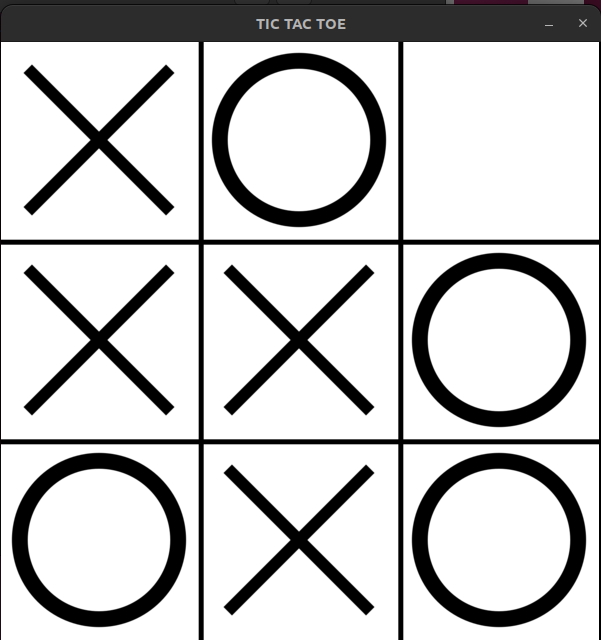
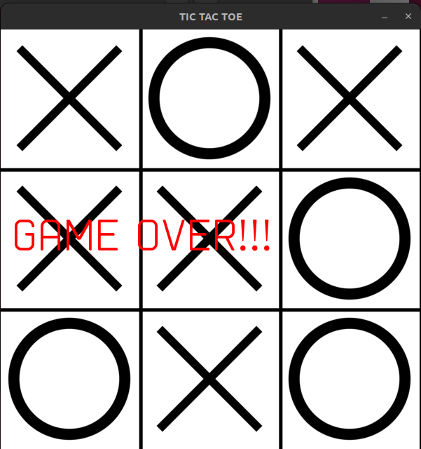
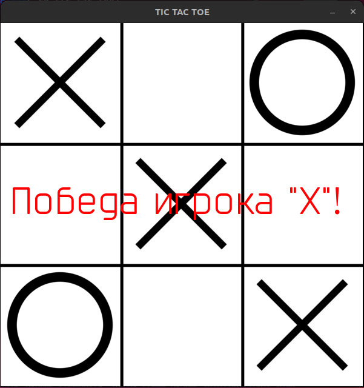

# 'Крестики - Нолики'

Классическая игра 'Крестики-Нолики'.

На данном этапе ход начинает пользователь. (Изменить можно в переменной `current_user`)
По умолчанию, пользователь играет 'X'. (Изменить можно в переменной `players`)

## Снимки экрана:

## Установка и запуск

1. Убедитесь, что у вас установлен `Python 3.10` и `Poetry`
2. Клонируйте репозиторий с github
3. Установите зависимости с помощью Poetry `poetry install`
4. Перейдите в директорию с файлом `main.py`
5. Выполните  команду для запуска игры `poetry run python main.py`

# TO DO

1. Добавить 'ИИ' для компьютера, сейчас ход выбирается рандомно
2. Реализовать возможность выбора фигуры и очередности хода
3. Подключить БД для запоминания текущего игрока и для статистики
4. Реализовать возможность сетевой игры
5. Рестарт игры без перезапуска приложения
6. Выбор уровня сложности с 'ИИ' либо рандомный ход
